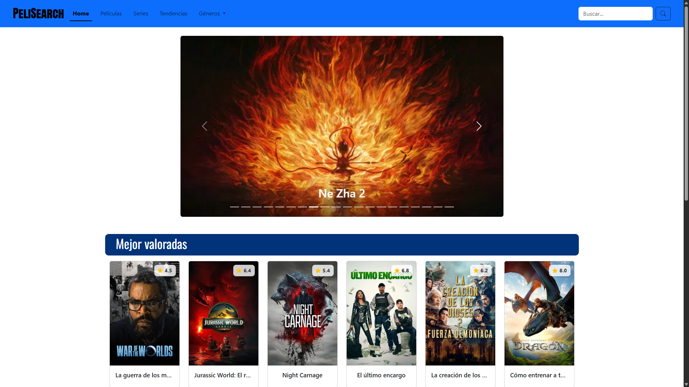
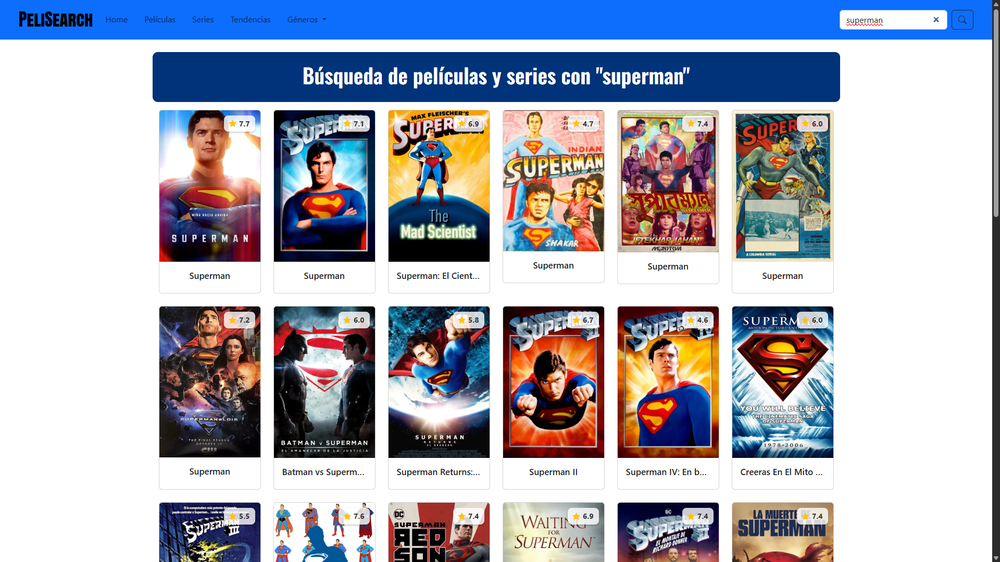
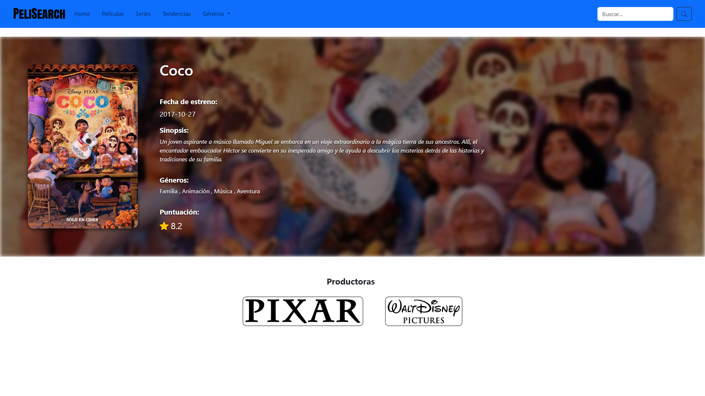

# 🎬 PeliSearch

This project is a web application built with [Angular](https://angular.dev/) that allows you to explore a catalog of movies and TV series.  
You can search by title and view detailed information such as synopsis, release year, and rating.

## ✨ Features

- **Quick search** for movies and series by name.  
- **Detailed view** with synopsis, rating, and release year.  
- **Fast loading** thanks to Angular and resource optimization.

## 📷 Screenshots

Here are some screenshots of the application in action:

  
*Main catalog view showing popular movies and series.*

  
*Search results displaying matched titles.*

  
*Detailed information of a selected movie or series.*

## 📦 Installation & Setup

To set up and run the project locally, follow these steps:

1. Clone the repository:
   ```bash
   git clone https://github.com/vanesapicazo/PeliSearch.git
   cd pelisearch

2. Install dependencies:
   ```bash
   npm install

3. ⚠ Important: Create the environment.ts file
   Before running the project, create a folder named environments inside src/app and add a file named environment.ts with the following content:
   ```bash
   export const environment = {
    apiKey: 'YOUR_TMDB_API_KEY',
   };
  Replace YOUR_TMDB_API_KEY with your TMDB API key. You can get one for free by creating an account on TMDB.

4. Start the development server:
   ```bash
    ng serve
Once the server is running, open your browser and go to http://localhost:4200/. The application will automatically reload whenever you modify any of the source files.

##  🛠 Technologies Used

- **Angular:** Frontend framework
- **TypeScript:**  Programming language
- **Bootstrap:** UI styling and layout
- **TMDB API:** Movie and TV series data

##  📌 Future Improvements

- Favorites list
- Pagination for long result lists

##  🤝 Contributing

Feel free to fork the repository and submit pull requests.
Suggestions and bug reports are welcome.
